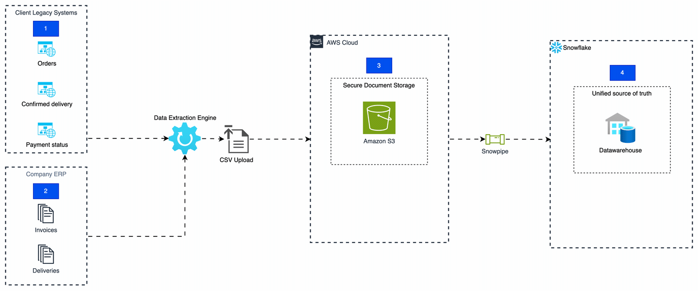
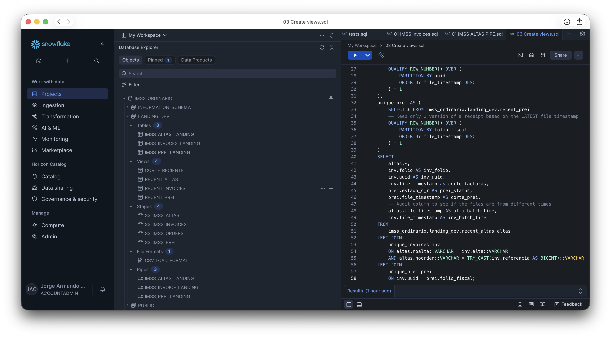
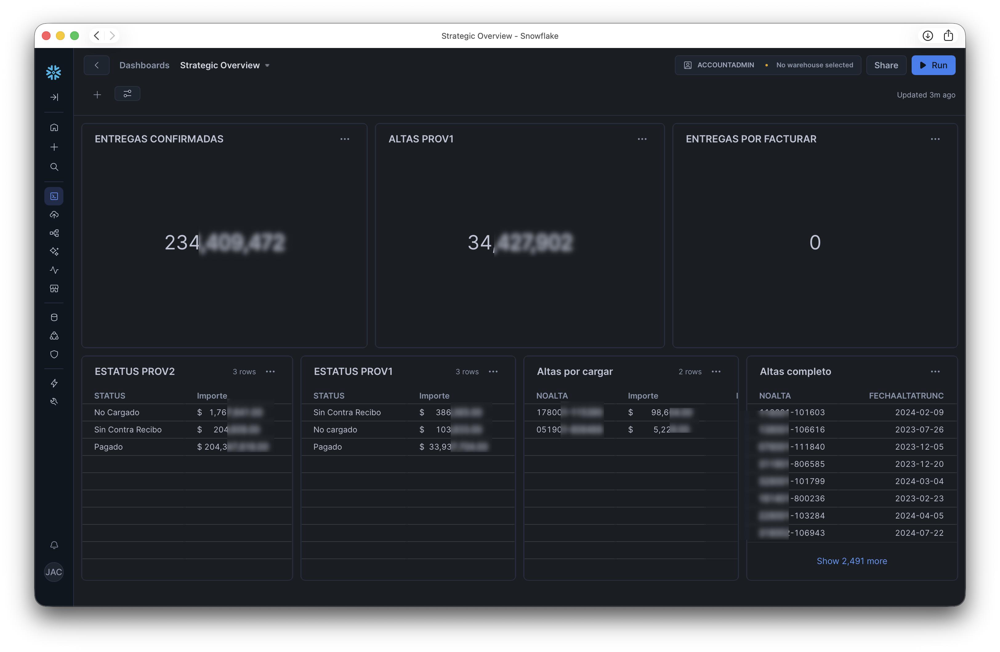

## The Challenge: Information Silos and Legacy Systems

The business line focused on sales to public institutions through Master Service Agreement (annual or biennial agreements with daily orders). However, the **Order-to-Cash** cycle was fractured due to the lack of a "Single Source of Truth." Critical data regarding orders, deliveries, and cash collections resided in government legacy systems with strict query restrictions and no available APIs.

**Negative Impact:**

- **Financial Risk:** Over 2,000 daily transactions relied on manual reconciliations.
- **Operational Inefficiency:** Teams spent more time reconciling data in Excel than performing their primary tasks.
- **Departmental Friction:** Constant reconciliation meetings were required to determine contract balances or delivery statuses.

### The Solution: End-to-End (E2E) Data Architecture

I designed and implemented a comprehensive solution to automate data acquisition, processing, and visualization:

1. **Acquisition (Python & Selenium):** Developed a web scraping engine that emulates human behavior to extract reports from legacy systems, transforming inaccessible portals into constant, reproducible datastreams. [Available on GitHub](https://github.com/armjorge/IMSS_SAI_PREI)
2. **Infrastructure (AWS S3 & Snowflake):** Implemented an automated upload flow to Amazon S3. Using **Snowpipe**, I enabled Snowflake to process files immediately through a low-cost serverless architecture.
3. **Integrity and Quality (SQL & Jinja):** Created dynamic views and cleaning processes to eliminate duplicates and automatically link Purchase Orders with Invoices and Treasury Status.

### Impact and Results: From Reaction to Strategy

The implementation transformed the company's operational culture:

* **100% Cash Conversion:** Full visibility of invoices in progress and factoring systems, ensuring no revenue is lost.
* **Elimination of Friction:** Manual reconciliation meetings were eliminated; all departments now consult the same data in real-time.
* **Financial Predictability:** The finance department now has projected cash flows with total precision.
* **Logistics Control:** Ability to supervise and audit two logistics providers in parallel through automated delivery compliance KPIs.
* **Cost Efficiency:** Processing over 3,000 records with a cloud operating cost of less than **$10 USD per month**.

### What this project demonstrates about my profile:

- **Problem-Solving Ability:** I don't stop at the lack of an API; I build the necessary bridge.
- **Business Vision:** I understand that data serves to collect payments faster and work with less friction.
- **Resource Optimization:** I design cloud architectures that are powerful yet extremely economical.

