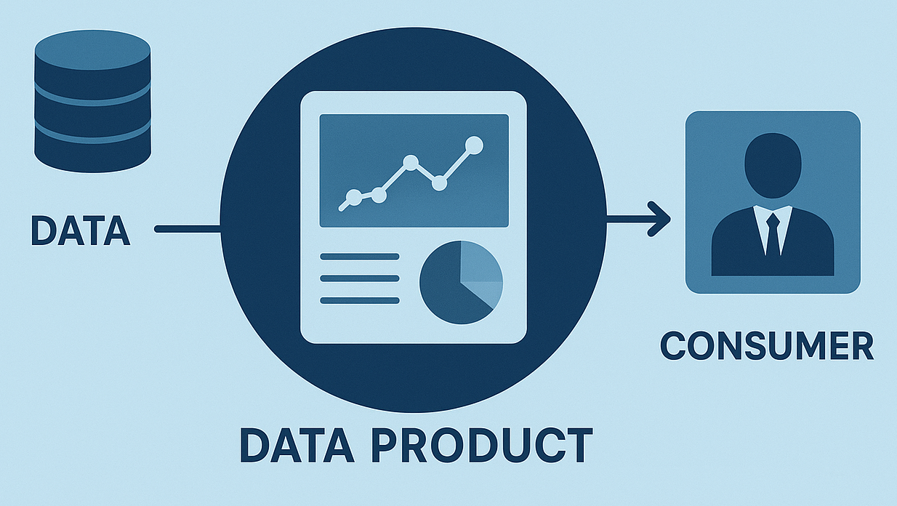

## Necesidad

Como tomador de decisiones en una empresa farmacéutica, necesito acceso inmediato a inteligencia de mercado consolidada —precios vigentes, panorama competitivo, volúmenes históricos y descripciones de producto— en el momento en que se publica una nueva demanda gubernamental, para poder evaluar oportunidades rápidamente, fijar precios competitivos y tomar decisiones de licitación basadas en datos.

### La Solución: Data Product

Un *data product* es información lista para consumo directo por parte de los usuarios de negocio, sin pasos intermedios de limpieza o reconciliación manual.

En conjunto con el cliente, se definió un MVP con la siguiente estructura de información:

| Campo | Descripción |
| --- | --- |
| **Clave Compendio** | Código de producto; funciona como llave sustituta (*surrogate key*) para unir con otras fuentes |
| **Descripción** | Descripción del producto |
| **Marca** | Nombre de marca |
| **Fabricante** | Fabricante |
| **IMSS** | Volumen de la institución principal 1 |
| **IMSS Bienestar** | Volumen de la institución principal 2 |
| **Otros** | Volumen de otras instituciones |
| **Máximos** | Suma de instituciones principales + otros |
| **Precio Actual** | Precio vigente |
| **Total** | Tamaño de mercado (precio × piezas) |
| **Contrato Actual** | Proveedor actual |
| **IMSS/ISSSTE** | % de piezas provenientes de instituciones financieramente sólidas |
| **Otros** | Año base de comparación (anterior) |
| **Riesgo (Otros)** | Proporción otros / IMSS / ISSSTE |

**El reto:**

El producto debe ser escalable: en 2026 se han publicado tres versiones de la demanda para el periodo 2027–2028, por lo que es crítico mantener profundidad histórica para identificar qué cambia, producto por producto, entre versiones. Además, debe ser posible incorporar nuevas fuentes de demanda de forma rápida conforme surgen.

### Estrategia

Se utiliza Jira para trackear las historias necesarias y vincular los epics a los proyectos de Atlassian, organizando el trabajo en tres frentes:

**Data Modeling**
Despivoteo (*unpivot*) de los datos de demanda para hacerlos escalables.

**Data Pipeline**
CSV crudo simple + stage en Snowflake, bajo arquitectura medallion (Raw → Work → Gold).

**Data Analysis**
Cruce intensivo de fuentes para entregar al cliente un producto que recibe actualizaciones mensuales de inventario, consumo real, precios y proveedores.

## Resultado

Producto con información actualizada a abril de 2026, en operación y a la espera de la publicación definitiva de la demanda para el proceso de compra del periodo 2027–2028.