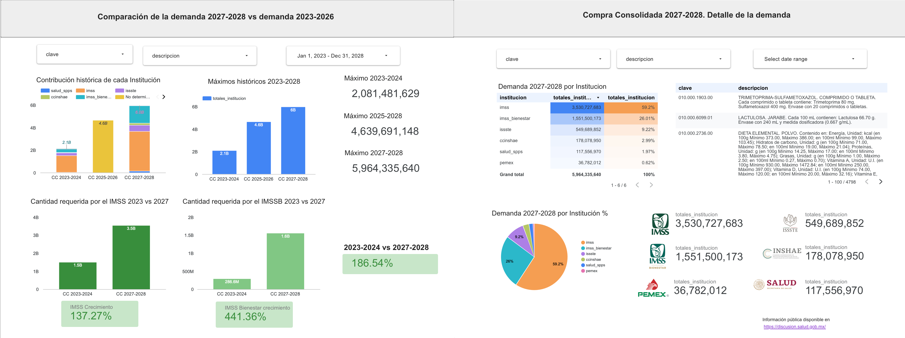

## Problème

Les fournisseurs de produits pharmaceutiques et de matériel médical souhaitant vendre aux institutions gouvernementales font face au défi d'identifier :
- Quels produits sont achetés ?
- Quelles institutions achètent chaque produit ?
- Combien d'unités sont acquises de chacun ?
- Comment la demande a-t-elle évolué au fil du temps ? Est-elle en croissance, en déclin, ou le produit est-il exclu ?

En décembre 2025, [les informations d'approvisionnement pour la période 2027-2028](https://discusion.salud.gob.mx/) ont été rendues publiques, offrant une opportunité unique pour planifier les ressources et prioriser le lancement de produits. Cela soulève une question cruciale :

**Quels produits devons-nous prioriser ?**

## D'où vient le problème ?

La base de données contient des informations de 3 procédures d'approvisionnement bisannuelles avec 4 798 produits uniques répartis dans 11 institutions, totalisant 12 685 508 417 unités achetées. Avec plus de 38 000 lignes de données, répondre à ces questions nécessite une technologie appropriée.

## Solution

Chaque produit possède un identifiant unique appelé **'Code de catalogue de base'** (Clave de cuadro básico) qui permet de le suivre à travers les procédures d'approvisionnement.

### Étape 1 : Créer une table maître des produits

Comme toutes les procédures n'incluent pas les mêmes codes, nous avons besoin d'une table contenant tous les produits pour que les filtres du tableau de bord fonctionnent correctement :

| code            | description                                             |
| --------------- | ------------------------------------------------------- |
| 010.000.4301.00 | ERTAPENEM. SOLUTION INJECTABLE. Chaque flacon contient… |
| 010.000.6357.00 | BUDÉSONIDE-FORMOTÉROL. AÉROSOL. Chaque gramme contient… |
| 010.000.4225.00 | IMATINIB. COMPRIMÉ. Chaque comprimé enrobé contient…    |

### Étape 2 : Intégrer avec BigQuery et Looker Studio

**Looker Studio** offre une option immédiate pour la visualisation, tandis que **BigQuery** fournit le moteur pour rendre l'analyse rapide et évolutive.

La construction du pipeline Databricks qui génère la base de données peut être consultée ici : [Conception et nettoyage des données](../medallion).

### Étape 3 : Table analytique par institution et procédure

| code            | achat        | institution | totaux_max     | totaux_institution | description                                      |
| --------------- | ------------ | ----------- | -------------- | ------------------ | ------------------------------------------------ |
| 010.000.0104.00 | CC 2027-2028 | IMSS        | 226,092,211.00 | 166,856,793.00     | PARACÉTAMOL. COMPRIMÉ. Chaque comprimé contient… |
| 010.000.0104.00 | CC 2023-2024 | IMSS        | 145,202,987.00 | 116,783,741.00     | PARACÉTAMOL. COMPRIMÉ. Chaque comprimé contient… |

### Étape 4 : Table pivot avec évolution temporelle

Une vue consolidée résumant les quantités par code à travers les trois procédures d'approvisionnement :

| code            | description                                    | max_2023_2024 | max_2025_2026 | max_2027_2028 |
| --------------- | ---------------------------------------------- | ------------- | ------------- | ------------- |
| 010.000.0246.00 | PROPOFOL. ÉMULSION INJECTABLE. Chaque ampoule… | 1,881,146.00  | 2,863,790.00  | 4,345,683.00  |

## Résultats

Un tableau de bord interactif qui permet aux fabricants de :
- Identifier les tendances de croissance ou de déclin par produit
- Segmenter les informations par institution et procédure d'approvisionnement
- Prendre des décisions éclairées sur les produits à prioriser pour 2027-2028

Accéder au tableau de bord :
> [Tableau de bord sur Looker](https://lookerstudio.google.com/reporting/c0f3b5c5-c208-4a5a-b81e-9f136d65251e)